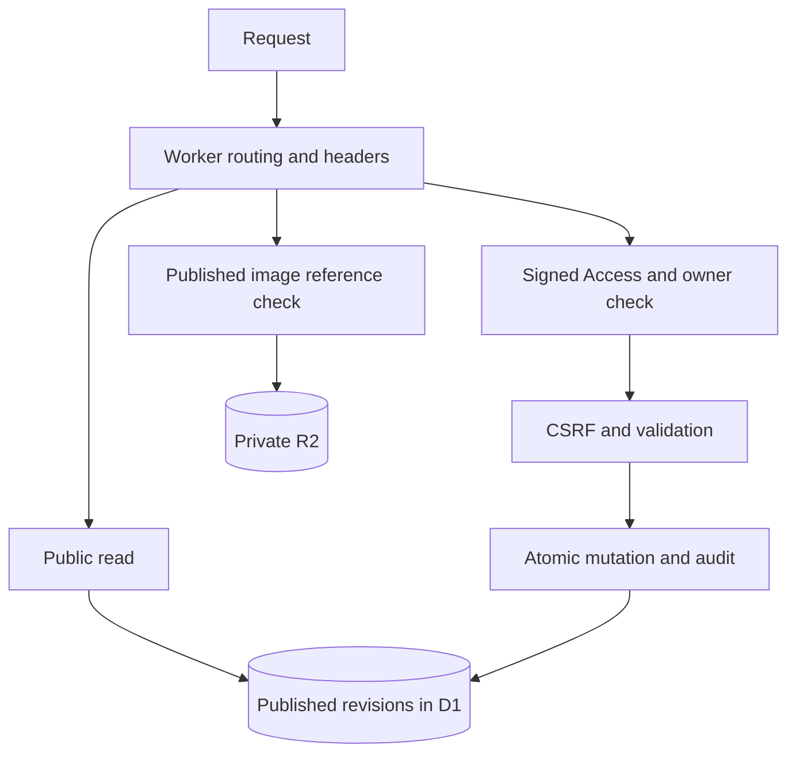

# Architecture

## Decisions

| Decision                            | Reason                                                                   | Alternative                                  | Consequence                                                     |
| ----------------------------------- | ------------------------------------------------------------------------ | -------------------------------------------- | --------------------------------------------------------------- |
| Hono + TypeScript SSR               | Small Worker-native request boundary, semantic HTML, little browser code | React/Vinext application                     | Explicit native forms and progressive enhancement, no hydration |
| D1 normalized immutable revisions   | Atomic changes and clear draft/public separation                         | Markdown-only files or external CMS          | Database required; revision history retained                    |
| Drizzle schema and reviewed SQL     | Reproducible migrations and explicit runtime queries                     | Full runtime ORM                             | Maintain bound D1 SQL alongside schema                          |
| Private R2 normalized PNG           | Predictable raster handling and publication-aware delivery               | Arbitrary uploads or external image URLs     | Browser converts JPEG/WebP; server independently validates PNG  |
| Access + signed JWT + owner subject | No homemade login or obscurity                                           | Password or unsigned-header trust            | Edge policy and Worker configuration both matter                |
| External CSS and browser modules    | Strict CSP; public GET flows without JS                                  | Large client-side framework                  | Small custom interaction modules                                |
| Direct Cloudflare deployment        | User permits pushes only to this repository                              | Managed Sites with another source repository | Account configuration remains an external setup step            |

The editorial design uses cool paper, dark ink and vermilion, two selected studies followed by compact rows, semantic diagrams and a chronological log. It is distinct from the earlier desktop and blueprint portfolio designs.

## Request flow

Cloudflare Access is the external first gate for administrative paths. The Worker independently validates the assertion. `run_worker_first` prevents static assets bypassing the application boundary. Only named public assets are served; unknown source/debug paths return 404.

## Integrity and privacy

A project owns stable identity, draft and published revision pointers, and an optimistic version. Save inserts an immutable revision and child rows, advances only the draft pointer, increments the version and audits the action in one D1 batch transaction. A NOT NULL/unique expected-version claim rejects concurrent writes even when preflight reads race.

Publish advances the public pointer. Unpublish clears it. Delete is soft deletion, only after unpublish and exact slug confirmation. A once-published slug remains fixed. Public queries select no private notes or editing IDs, filter private/deleted relationship targets, and use published revision timestamps. Public image delivery verifies the current published reference belongs to the image's project.

All values are SQL parameters; interpolated identifiers come from fixed source allowlists. Migrations contain foreign keys and lookup indexes. The seed runs only on an empty archive and is never a runtime fallback. An interrupted first CLI seed requires inspection before retrying; its nonempty guard protects existing work.

## Performance and limits

The personal archive supports up to 500 active records and bounded strings/child lists/uploads. Initial content is 13 projects. Public reads use nine batched queries, loading complete published records for consistent filters and graphs. Measure and add query-level pagination before substantial growth. The system is not an unbounded CMS.

The built Worker is about 532 KB raw / 140 KB gzip. No browser framework, remote fonts or analytics are required. Dynamic pages/APIs and images use no-store for immediate publication boundary changes; static assets cache for one hour. Already downloaded public content cannot be recalled.

Immutable revisions and audit grow over time. Monitor D1/R2 size, Worker CPU and rate limiting. No automatic history purge exists. D1/R2 do not share a transaction: failed image cleanup may leave unreachable private objects. Back up and reconcile carefully; historical references may still require bytes.

## Source map

| Path                       | Responsibility                                       |
| -------------------------- | ---------------------------------------------------- |
| `src/index.tsx`            | Routes, middleware, images and API boundaries        |
| `src/security/`            | Access, CSRF, headers, bounded bodies and PNG        |
| `src/content/`             | Validation, repository, Markdown, reviewed seed      |
| `src/views/`, `public/`    | Escaped rendering, diagrams and progressive controls |
| `db/schema.ts`, `drizzle/` | Schema, migrations and source snapshots              |
| `scripts/`, `tests/`       | Import, production guard, scans and verification     |

The exported Worker never supplies the test-only authorization dependency. No request, environment value or public route can select it. Workerd smoke tests run the unchanged built Worker and mock only the configured JWKS HTTP response.
